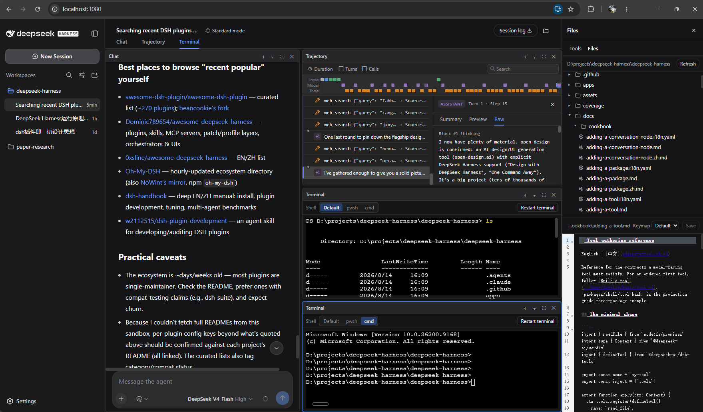

# dsh-files-panel

**Interactive terminal, workspace file browser, and tmux-style split panes for the DeepSeek Harness web GUI (`dsh web`).**

This plugin extends the [DeepSeek Harness](https://github.com/deepseek-ai/deepseek-harness) browser surface with three features:

| Feature | What you get |
|---|---|
| **Terminal** | A real interactive terminal tab beside Chat/Trajectory. Per-pane PTYs with a shell picker (Windows: `pwsh` / `cmd`; Linux/macOS: `bash` / `zsh` / `sh`). |
| **File browser** | A workspace file tree with per-type icons and syntax-highlighted editing (save with conflict detection, Vim/Emacs keymaps, drag-resizable tree/editor split). |
| **Split panes** | tmux-style panes: recursive split right/down, per-pane fullscreen, draggable dividers, sizes that follow the window. Splitting a Chat pane starts a **new session** side by side, and **each chat pane gets its own input box** sized with the pane. |

## Screenshot



## Install

The plugin is a set of packages inside the `deepseek-harness` monorepo. Apply the single cumulative patch to a clean checkout, then build:

```bash
# in a deepseek-harness checkout at base commit 47f943859b
git apply path/to/dsh-files-panel.patch
pnpm install
pnpm run build
pnpm dsh --profile web   # do NOT use npx @deepseek-ai/dsh web
```

Open the printed URL (default `http://127.0.0.1:3080`) and hard-refresh (`Ctrl+F5`).

## Usage

- Open a session → the **Terminal** tab opens a live shell; the toolbar lets you pick the shell and restart it.
- The **folder icon** in the session header opens the workspace file browser.
- Each pane's thin toolbar has **⫞** split right, **⫟** split down, **⛶** fullscreen, **✕** close. Focus a pane, then click the top tab to switch its view (Chat / Trajectory / Terminal). A split chat pane has its own input box; closing a pane re-flows the rest to fill the grid.

Full usage: [docs/USAGE.md](docs/USAGE.md) · [docs/USAGE.zh.md](docs/USAGE.zh.md)（中文）

## Repository layout

```
patch/dsh-files-panel.patch   the single cumulative patch (everything above)
src/packages/                 the plugin source, mirroring the monorepo packages/ layout
assets/layout.png             the layout screenshot shown above
```

`src/packages/` mirrors the harness monorepo paths, so each file's location tells you where it belongs:

- `host/web-terminal`, `host/web-terminal-local` — terminal capability seam + local provider
- `host/workspace-files`, `host/workspace-files-fs` — workspace file seam + provider
- `host/apiproxy/src/api/{terminal,files}.*` + `fetch/*` — the `terminal.*` / `files.*` wire domains
- `client/ui-terminal`, `client/ui-files` — the browser Terminal and file-panel views
- `client/ui-conversation` — the split-pane grid, pane store, and cross-session panes
- `client/ui-slots`, `client/web-react`, `client/runtime` — framework additions (`SessionBoundary`, `provideInfoOf`)
- `client/tsdown.client.ts`, `bundle/web-app` — build + registration

## Limitations

- Terminal output is polled (~60 ms), not streamed; fixed size, `TERM=dumb` (no color / full-screen programs yet).
- A split grid shares each session's chat state across panes of that session.
- The file tree and terminal are human-facing only; their content is not fed to the model.

## License

MIT
